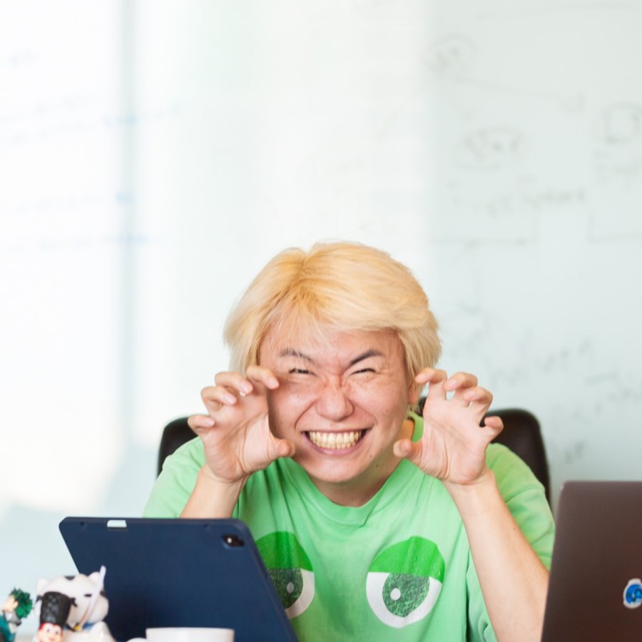

# 自分の業務設計ハーネスの第一歩

### 〜 成功と、失敗と、失敗と… 〜

By ごん

LT発表 / 2026-04-19

---

## 自己紹介 〜 ごんの略歴 〜

- 東大、落ちた
- 20歳で会計士合格 → 監査法人勤務
- なぜかセブでエロアプリ開発で起業 🔞
- 誕生日に全部消された 💥 → 『英語物語』開発へ
- コロナで日本に帰国
- 社員教育が苦手すぎて、AIに期待 🤖

---

## あれ…？ 🤔

- 社員教育が苦手 → じゃあ **AIへの教育も苦手**…？
- プログラマ歴 **10年超**
- Claude Max が出る前から「AIやるぞー！」と意気込んで
- …それでも **ぜんぜんうまくいかない**

> 今日は、失敗し続けた **AI駆動開発の振り返り** の話をします

---

## 良かった事

- **英語物語** の機能開発・バグ修正が日常業務レベルで時短
- **Javaサーバのレガシーリプレイス**
  - フレームワーク移行を **ほぼ全部AIに書かせた**
  - 推定費用 **▲数千万円** / **本稼働済み** ✅
- **経費精算** の自動化
- **プレゼン資料作成** もラクに（← 今まさにこのLTも）

---

## 悪かった事 〜 仕事が雑になった 〜

- バグが増えた 🐛
- リファクタ指示の嵐
- 雑なドキュメント・コードが増えた
- AIを使うための **研究時間と費用** が激増
- ターミナル見すぎて、目と体が痛い

---

## これを解決するのが…

# **自分の業務設計ハーネス**

> まさおさんの研究部に入った **2番目の目的** でもあります 🎯

---

## 第1歩目中の反省点

- 簡単に作れるから、**要らないもの** を作りがち
- 理想論にとらわれて、**過剰設計** しがち
- **レビューをサボって**、出戻りの嵐

---

## 第1歩目中の「兆し」✨

- **ハーネスUI** を作成
- **全業務を一元管理**
- シンプルな **ハーネス事例集**
- 業務設計業務に **ゆっくり全集中**

---

## ふと、刺さった言葉 📖

業務設計の本で見つけた、**イーロン・マスクの5つの戒律**

1. 要件はすべて疑え
2. 部品・工程はできる限り減らせ
3. シンプルに最適化しろ
4. サイクルタイムを短くしろ
5. **自動化しろ。これは最終段階だ。**

> いきなり **#5** から始めて、時間を溶かしていたのかも。

---

## まとめ

- 当面は **業務設計業務** と **ハーネスパターン学習** に全集中
- AIを極めて、**一人でガンガン作れる** ようになりたい
- …でも **一人は寂しい** 😢

> 研究部に入った **1番の目的** は、
> **切磋琢磨する友達** を見つけること

よろしくお願いします ♪
